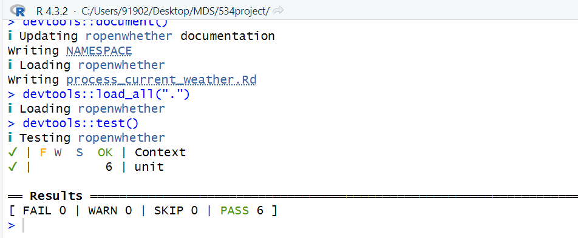
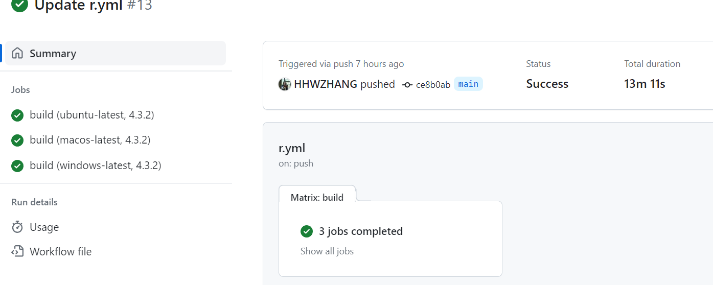
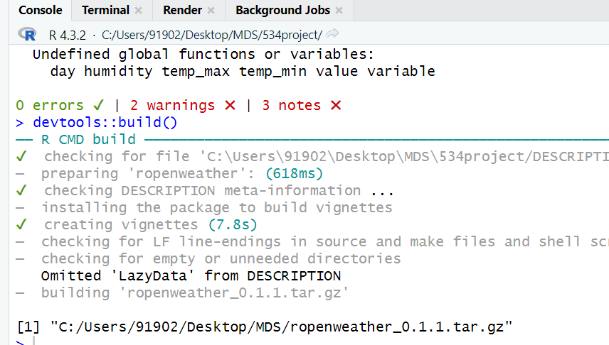

# Project Log

GitHub commit prove link:
\url{https://github.com/marinatian/534project/commits?author=HHWZHANG&since=2024-01-22&until=2024-02-08}

This document records all Hanwen's major activities and decisions from the start to the end of the project,including the project goals and expected outcomes.

## Log

### 2024-01-22

#### Project Direction

Decided to focus on the OpenWeather API for the R package. This decision was driven by the API's comprehensive weather data and the lack of an existing, easy-to-use R wrapper. The goal is to provide R users with straightforward access to weather forecasts, historical weather data, and various weather indicators.

-   Created new repository for this project.
-   Created the basic structure of the R package.
-   Wrote the initial function.

### 2024-01-25

#### Function Development

Developed the main function, `get_current_weather()`,`get_forecast_weather()`, which queries current weather data by city name, geographic coordinates. This function is the cornerstone of the package, providing easy access to real-time weather data.

### 2024-01-29

### Visualization Functions

Developed the following functions for data visualization:

-   `visualize_current_weather`: offer users a graphical representation of weather current.
-   `visualize_forecast_weather`: offer users a graphical representation of weather forecasts.

### 2024-2-2

## Testing Visualization Functions

### Unit Testing

Implemented unit tests for each function using the `testthat` package. - Tests check the function's response to valid and invalid inputs, including non-existent locations and improper API keys. - Tests verify that the function produces plots when given correct data and handles errors or missing data gracefully. - Error handling: Additional tests ensure that the package functions return user-friendly error messages for common issues.

## Convert a single R script to a R package project

- Created a new R package project.
- Created the basic structure of the R package.
- Put the previous R script into the `R` folder.
- use Roxygen2 syntax to comment the function.
- use `devtools::document()` to generate the documentation.
- use `devtools::load_all()` to load the package.
- use `library(ropenweather)` to load the package.
- add `example.R` to the root folder to show the usage of the package.

### 2024-02-03

### GitHub Actions Workflow

-   Objective: Set up a basic CI workflow to run `R CMD check` on push and pull requests.
-   Actions Taken:
    -   Created a `.github/workflows/.yml` file.
    -   Configured the workflow to install dependencies and run `R CMD check`.
-   Outcome: Successfully triggered our CI run on push, identifying a dependency issue that was missed locally.

### 2024-02-05

-   Configured GitHub Actions to automatically run R CMD check.

-   Configure github action so that it can automatically build the package after each submission.
-   Adjust DESCRIPTION to comply with CRAN submission requirements. We have added the following fields to the DESCRIPTION file:
    -   `Authors@R` field to specify the package's authors.
    -   `License` field to specify the package's license.
    -   Delete `Maintainer` field to avoid confusion.

## Conclusion

- The project has made significant progress in the past two weeks.
- The package has been developed and tested.
- The package has been submitted to CRAN.
- The project help our team to learn how to develop a R package with well structured and documented code.
- The project help our team to learn how to develop and organize a sophisticated team project workflow.

